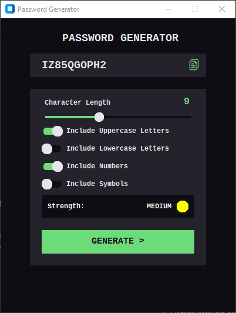
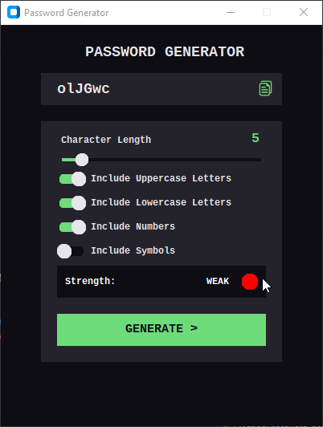
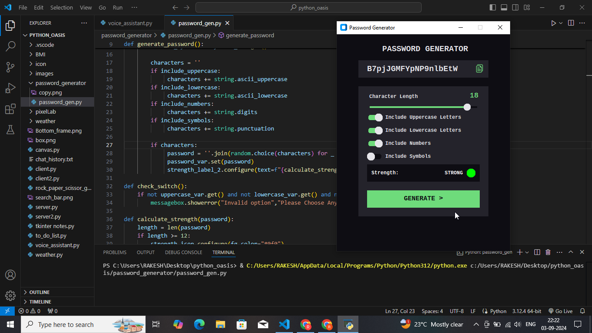

## Password Generator 🔐

A sleek and intuitive password generator application built using CustomTkinter and Python. This tool allows users to generate strong and secure passwords tailored to their preferences, ensuring online safety and data security.

### Features:
- **Customizable Password Criteria**: Select from uppercase letters, lowercase letters, numbers, and symbols to create a password that fits your security needs.
- **Adjustable Length**: Choose the desired length of your password with an easy-to-use slider.
- **Password Strength Indicator**: Get instant feedback on the strength of your password with a visual indicator (Weak, Medium, Strong).
- **Copy to Clipboard**: Quickly copy your generated password to the clipboard with a single click.
- **User-Friendly Interface**: Enjoy a clean, modern, and responsive GUI that makes password generation simple and efficient.

### Technologies Used:
- **CustomTkinter**: For creating the modern, themed GUI.
- **Python**: Core logic and functionality.
- **Pillow**: Handling image assets in the application.

### How to Run:
1. Clone the repository: `git clone https://github.com/Rakesh-Bhandari/Oasis-_infobyte_task_3.git`
2. Install the required dependencies: `pip install -r requirements.txt`
3. Run the application: `python password_generator.py`

### Screenshots:

### Contributions:
Feel free to fork the project, create a pull request, or open an issue if you find a bug or have a feature request!
